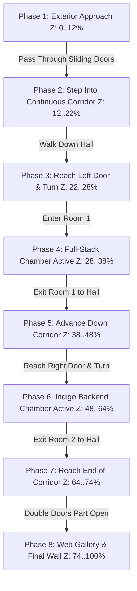

# 2.5D Scroll-Story Portfolio: Architecture & Technical Specification (Continuous Corridor Spine Model)

## Executive Summary
This document defines the technical architecture, spatial coordinate model, continuous camera choreography, layer lifecycle, and realistic performance engineering for the **Continuous Corridor Spine** 2.5D portfolio.

Rather than a slideshow of 6 discrete scenes that crossfade in and out, the entire website is structured as a **single uninterrupted architectural walkthrough**. The visitor enters a modernist building and traverses one persistent corridor spine that extends along the spatial depth axis ($Z_{\text{world}}$). Rooms for specific portfolio topics (Full-Stack Development, Backend & Application Pipelines) are alcoves positioned at fixed stations along this corridor. The character walks down the hall, turns and enters each room when reached, explores its contents, exits back out into the hallway, and advances to the grand gallery and destination wall at the end of the corridor.

---

## 1. The Continuous Spatial World Model



### 1.1 Spatial World Coordinates ($Z_{\text{world}} \in [0.0, 1.0]$)
The entire scroll container height (`h-[700vh]`) maps to a normalized continuous journey parameter $Z \in [0.0, 1.0]$:

| Phase | Range ($Z$) | Camera Position & Action | Character State | Visible Environment |
| :--- | :--- | :--- | :--- | :--- |
| **1. Exterior Approach** | `0.00 - 0.12` | Dolly toward villa facade | `APPROACH_VILLA` (walking up stairs) | Exterior sky, sandstone facade, flora |
| **2. Entrance Threshold** | `0.12 - 0.22` | Dolly through sliding doors into corridor | `ENTER_CORRIDOR` (stepping through door) | Entrance portal, corridor horizon reveals |
| **3. Corridor Walk $\to$ Room 1**| `0.22 - 0.28` | Dolly down corridor, camera pivots left | `WALK_CORRIDOR` $\to$ `TURN_LEFT` | **Persistent Corridor Spine** + Left Door |
| **4. Room 1 (Full-Stack)** | `0.28 - 0.38` | Camera pushes into left room chamber | `INSIDE_ROOM_1` (standing beside left door) | Full-Stack room interior + DOM Skills Deck |
| **5. Exit Room 1 $\to$ Corridor**| `0.38 - 0.48` | Camera pulls back to center corridor spine | `EXIT_ROOM_1` $\to$ `WALK_FORWARD` | **Persistent Corridor Spine** advances |
| **6. Room 2 (Indigo Chamber)** | `0.48 - 0.64` | Camera pivots right & pushes into room | `TURN_RIGHT` $\to$ `INSIDE_ROOM_2` | Indigo Tech Chamber + DOM Arch Diagram |
| **7. Exit Room 2 $\to$ End Hall** | `0.64 - 0.74` | Camera pulls back to center hall & advances | `EXIT_ROOM_2` $\to$ `WALK_FORWARD` | **Persistent Corridor Spine** reaches end portal |
| **8. Web Gallery & Contact** | `0.74 - 1.00` | Double portal opens; camera enters gallery | `WALK_GALLERY` $\to$ `STAND_DESTINATION` | Expansive gallery, pedestals & contact wall |

---

## 2. Mathematical Kinematics & Camera Choreography

### 2.1 The Persistent Corridor Spine Projection
The corridor is rendered using CSS 3D transforms (`perspective: 1200px`) and continuous scale/translation dollying.
For global scroll progress $Z \in [0.12, 0.78]$:
$$\text{CorridorScale}(Z) = 1.0 + (Z - 0.12) \times 0.65$$
$$\text{CorridorTranslateY}(Z) = -(Z - 0.12) \times 18\text{vh}$$

As the user scrolls, the corridor walls, floor lines, and ceiling lights continuously move toward and past the camera, creating the physical sensation of walking down a building corridor.

### 2.2 Camera Pivot & Room Entry/Exit Transform
When entering a side room, the camera smoothly pans and dollies off the center corridor axis:

- **Room 1 (Left Alcove, $Z \in [0.26, 0.38]$)**:
  $$\text{CameraPanX}(Z) = \text{smoothStep}(0.26, 0.30, Z) \times (+18\text{vw}) - \text{smoothStep}(0.36, 0.40, Z) \times (+18\text{vw})$$
  $$\text{Door1RotateY}(Z) = \text{clamp}\left(\frac{Z - 0.26}{0.04}, 0, 1\right) \times (-85^\circ) - \text{clamp}\left(\frac{Z - 0.36}{0.04}, 0, 1\right) \times (-85^\circ)$$

- **Room 2 (Right Alcove, $Z \in [0.50, 0.64]$)**:
  $$\text{CameraPanX}(Z) = \text{smoothStep}(0.50, 0.54, Z) \times (-18\text{vw}) - \text{smoothStep}(0.62, 0.66, Z) \times (-18\text{vw})$$
  $$\text{Door2RotateY}(Z) = \text{clamp}\left(\frac{Z - 0.50}{0.04}, 0, 1\right) \times (+85^\circ) - \text{clamp}\left(\frac{Z - 0.62}{0.04}, 0, 1\right) \times (+85^\circ)$$

- **End Gallery Double Doors ($Z \in [0.72, 0.78]$)**:
  $$\text{DoorSlideX}(Z) = \text{smoothStep}(0.72, 0.76, Z) \times (\pm 75\%)$$

---

## 3. Character Kinematics & State Machine

The character transitions across choreographed states:

```typescript
export type CharacterJourneyState =
  | 'APPROACH_VILLA'      // Phase 1: Approaching house from left of frame
  | 'ENTER_CORRIDOR'      // Phase 2: Stepping through front entrance
  | 'WALK_CORRIDOR_1'     // Phase 3: Walking forward along hallway
  | 'TURN_TO_ROOM_1'      // Phase 3.5: Turning left toward door
  | 'INSIDE_ROOM_1'       // Phase 4: Holding door open beside Full-Stack deck
  | 'EXIT_ROOM_1'         // Phase 5: Stepping back into corridor
  | 'WALK_CORRIDOR_2'     // Phase 5.5: Walking forward down hallway
  | 'TURN_TO_ROOM_2'      // Phase 6: Turning right toward monolithic door
  | 'INSIDE_ROOM_2'       // Phase 6.5: Standing at right beside architecture cards
  | 'EXIT_ROOM_2'         // Phase 7: Stepping back into corridor
  | 'WALK_TO_GALLERY'     // Phase 7.5: Walking to end double doors
  | 'WALK_GALLERY'        // Phase 8: Walking forward through modern gallery
  | 'STAND_DESTINATION';  // Phase 8.5: Small at bottom contemplating contact wall
```

### Character Trajectory & Frame Stepping:
- **Frame Advancement**: Driven strictly by **cumulative scroll distance traversed** ($\Delta y$ in pixels):
  $$\text{frameIndex} = \lfloor(\text{accumulatedDistance} / 35\text{px})\rfloor \bmod 12$$
  Snaps to neutral idle pose (Frame 0) when stationary.
- **Depth Stacking**: $z = 30$ (strictly above background/room plates $z=10-25$, strictly below DOM overlays $z=50$).

---

## 4. Performance Reality & Real DOM Unmounting Strategy

### 4.1 Measured Baseline (Current Build)
- In live browser testing under active scroll scrubbing, the existing build measured **23–48 FPS** depending on scroll velocity.
- The continuous corridor model is **heavier than the discrete crossfade model** because the corridor spine must remain active and rendered in 3D perspective alongside whichever room or door is currently in view.

### 4.2 Aggressive DOM Culling & Lifecycle Gating
To minimize GPU compositor pressure and CPU overhead, elements are **fully unmounted from the DOM** (returning `null` in React, destroying their DOM nodes and GPU textures) outside their active ranges:

| Element / Chamber | Mounted Range ($Z$) | Unmounted Outside Range? |
| :--- | :--- | :--- |
| **Exterior (Scene 1)** | $Z \in [0.00, 0.18]$ | **YES**: Fully unmounted (`null`) at $Z > 0.18$. |
| **Corridor Spine** | $Z \in [0.10, 0.78]$ | **YES**: Fully unmounted (`null`) once gallery is entered ($Z > 0.78$). |
| **Room 1 (Full-Stack)** | $Z \in [0.22, 0.44]$ | **YES**: Fully unmounted (`null`) when $Z < 0.22$ or $Z > 0.44$. |
| **Room 2 (Indigo Chamber)** | $Z \in [0.46, 0.68]$ | **YES**: Fully unmounted (`null`) when $Z < 0.46$ or $Z > 0.68$. |
| **Gallery & Contact** | $Z \in [0.65, 1.00]$ | **YES**: Fully unmounted (`null`) when $Z < 0.65$. |

### 4.3 Engine Migration & Dead Code Elimination
The old discrete engine files will be **completely deleted / replaced** to prevent dead code in the repository:
- `src/components/3d/PerspectiveStage.tsx` $\to$ **DELETED** (Replaced by `src/components/3d/ContinuousStage.tsx`)
- `src/components/3d/Scene.tsx` $\to$ **DELETED** (Replaced by `src/components/3d/CorridorSpine.tsx` and modular alcove components)
- `src/hooks/useScrollMaster.ts` $\to$ **DELETED** (Replaced by `src/hooks/useCorridorJourney.ts`)
- `src/hooks/useSceneProgress.ts` $\to$ **DELETED** (Merged into `src/hooks/useCorridorJourney.ts`)
- `src/components/character/CharacterSprite.tsx` $\to$ **DELETED** (Replaced by `src/components/character/JourneyCharacter.tsx`)
- `src/components/3d/Door3D.tsx` $\to$ **DELETED** (Unified in `src/components/3d/Door.tsx`)

---

## 5. Explicit Global Z-Index Hierarchy
- **$z = 10$**: Background plates & distant horizon
- **$z = 15$**: Persistent corridor walls & ceiling light cove
- **$z = 20$**: Midground architecture & floor reflections
- **$z = 25$**: 3D Animated Doors (Sliding & Hinged panels)
- **$z = 30$**: Character Sprite walker
- **$z = 40$**: Foreground portal arches & framing pillars
- **$z = 50$**: Real DOM Content Overlays (Hero HUD, Skill Cards, Architecture Diagram, Project Cards, Contact Wall)
